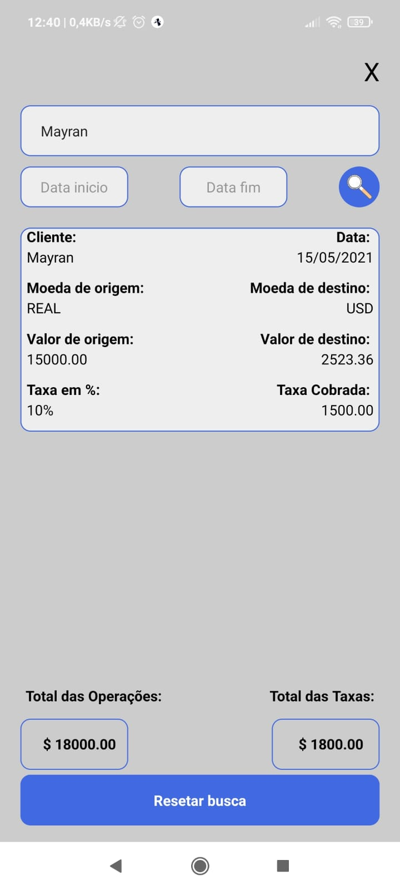

<h1>DESCRIÇÃO<h1>
<h3>Optei por fazer em React Native esse sistema de gerenciador de operações de conversões monetárias. Sou iniciante em react native, portanto usei todos os conhecimentos que obtive até agora e alguns outros pesquisando mais para conseguir fazer este app. Atualmente, é possivel converter de real para dolar americano, dolar canadense e euro. O app também faz registro de todas operações, assim como o total das operaçoes e taxas, filtro por nome de clientes e por data também estão disponiveis. </3>
<h1>Imagens do app </h1>

 
<h1>Como executar o codigo </h1>
<h3>Eu fiz o projeto em expo para facilitar a execução do mesmo, entao existem diversas formas de rodar o codigo. A mais fácil é baixando o app Expo Go na loja do seu celular e scaneando o QR code do link a seguir:  <a href=https://expo.io/@mayran/projects/MuitoDinheiro>https://expo.io/@mayran/projects/MuitoDinheiro  </a> </h3>
 
<h3>A segunda forma é clonando este repositorio do git para sua maquina. Após fazer a copia, rode o comando npm install ou expo install. Lembrando que sua maquina deve ter instalado o NodeJS, React native cli e expo cli para nao dar nenhum erro ao rodar o codigo. Após isso, basta executar o comando expo start, ele irá abrir uma janela web na qual você pode conectar por QR code ou usando um celular android com o modo dev habilitado. Eu recomendo utilizar o QR code com o expo go, é mais rapido e facil e previne qualquer bug ou problema que possa ocorrer.</h3>
 
<h1>Instruções de utilização<h1>
<h3>O app é bastante simples e de facil utilização. Primeiramente deve ser preenchido os campos de NOME DO CLIENTE, VALOR ORIGINAL,MOEDA DE DESTINO, COTAÇÃO E TAXA. A taxa já vem com o valor padrão de 10%, porém o usuario pode alterar para qualquer valor. Após preenchido os campos, basta pressionar o botão converter e o app converterá o valor para uma moeda de destino<h3>

 
<h3> O botão de relatorio leva o usuário para a tela onde estão salvas todas operações feitas, o valor total das operações e o valor total das taxas cobradas. Na aba relatório, também é possivel pesquisar operações pelo nome do cliente, basta preencher o campo pesquisar relatorio com o nome do cliente e apertar o botão send do teclado do celular, o app irá trazer somente as operações com o cliente selecionado </h3>

 
<h3> Abaixo do campo pesquisar relatório, há dois campos para pesquisa por data. O usuário deverá preencher da esquerda para direita, com a menor data a esquerda e a maior a direita, após os campos preenchidos, clicar na lupa para realizar a pesquisa. O campo de data deverá seguir a formatação DD/MM/YYYY. Caso o usuario deseje pesquisar uma unica data, preencha a mesma nos dois campos. </h3>

 
<h3> Por fim, temos os campos de valor total de operações e de taxas cobradas e mais abaixo o botão para resetar os filtros dos relatorios e mostrar todas operações novamente. </h3>
 

<h1> Eu tentei fazer um app simples e de facil utilização, espero que gostem.</h1>